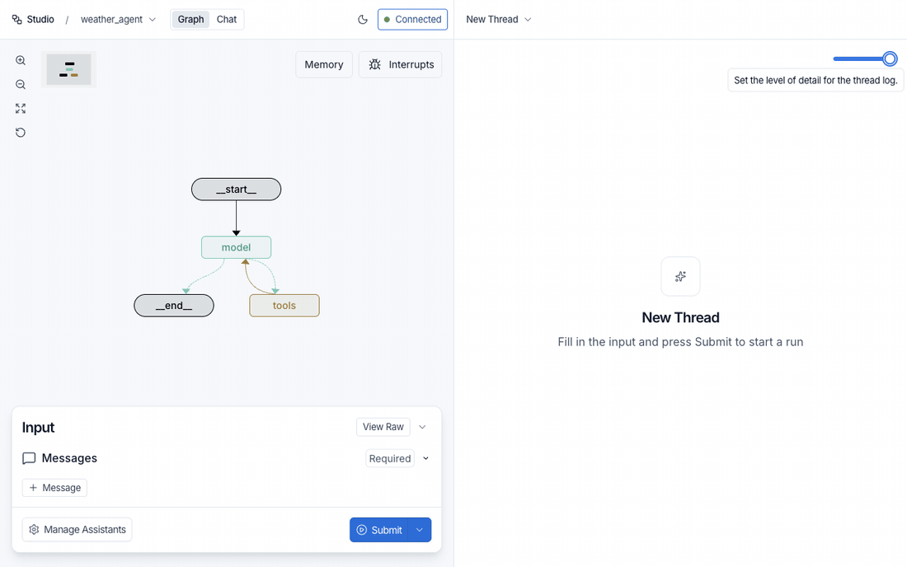

# LangGraph Studio (Unofficial)

[](https://github.com/azhig/Langgraph-studio-oss/actions/workflows/ci.yml)
[](https://github.com/azhig/Langgraph-studio-oss/releases)
[](LICENSE)


An open-source, self-hosted Studio for [LangGraph](https://github.com/langchain-ai/langgraph)
Agent Servers. It gives you the graph view, thread log, interrupts, assistants, memory and
chat mode of the hosted Studio, but runs entirely against your own server: no cloud,
no account, no `?baseUrl=` and no cross-origin requests.

Use it as a Python package mounted into `langgraph dev`, as a standalone proxy (Python or
Node), or as a VS Code extension.



> **Unofficial.** This project is not affiliated with, endorsed by, or supported by
> LangChain, Inc. LangGraph, LangChain and LangSmith are trademarks of LangChain, Inc. and
> are used here only to describe compatibility. The UI is written from scratch; it contains
> no code from the original Studio.

## Why

The hosted Studio at `smith.langchain.com` talks to your local server from the outside.
That means CORS errors against `http://127.0.0.1`, a mandatory LangSmith account, and a
tunnel allowlist to fight when you work around it. Serving the UI from the same origin as
the API removes all of that.

## Features

- **Graph**: auto-layout identical to the original, conditional edges, subgraph
  expand/collapse, drag, zoom, minimap, node hover cards with sources, targets and
  interrupt toggles, live highlighting of the running node.
- **Runs**: input form generated from `input_schema` (YAML/JSON, message builder for
  `messages`), `Submit`, `Cancel`, input history, `messages` stream mode toggle.
- **Threads**: thread picker with status, open by ID, `Cancel all pending runs`,
  thread log with three detail levels, `View state` for every checkpoint (values, JSON,
  full editor), relative timestamps.
- **Time travel**: `Re-run from here`, `Fork` (edit a node's state and continue), branch
  switching, error blocks with `Continue`.
- **Interrupts**: static `Before` / `After` on any node, `Interrupt on all`, resuming
  dynamic `interrupt()` calls, writing values `As Node`.
- **Assistants**: `Manage Assistants` with versions, `config_schema` fields, per-node
  configuration, graph switching.
- **Chat mode** for graphs with typed `messages`: streaming replies, thread panel,
  tool-call display, edit and regenerate.
- **Memory**: browse, create, edit and delete Store items by namespace.
- Light and dark themes. Every size, color and delay was measured on the original Studio.

Not included, by design: `Trace`, `Run experiment` and `Deploy`. They require LangSmith or
the cloud platform, which this project does not use.

## Requirements

- Python 3.9+ and a LangGraph Agent Server (`langgraph dev` from `langgraph-cli[inmem]`,
  or any server exposing the Agent Server API 0.4+).
- For the VS Code extension: VS Code 1.95+. No Python is needed on the machine running
  VS Code, only network access to the Agent Server.

## Python package

The package is not on PyPI yet. Install the wheel from the
[latest release](https://github.com/azhig/Langgraph-studio-oss/releases):

```bash
pip install https://github.com/azhig/Langgraph-studio-oss/releases/latest/download/langgraph_studio_oss-0.1.2-py3-none-any.whl
```

### Mode 1: mounted into `langgraph dev` (recommended)

The UI is served by the Agent Server itself, on the same port. Add one line to your
project's `langgraph.json`:

```json
{
  "dependencies": ["."],
  "graphs": { "agent": "./agent.py:graph" },
  "http": { "app": "langgraph_studio_oss:app" }
}
```

Run `langgraph dev` and open <http://127.0.0.1:2024/studio>. The API stays where it was
(`/assistants`, `/threads`, ...); the UI calls it with relative paths.

If you already have a custom `http.app`, mount the routes into it instead:

```python
from langgraph_studio_oss import mount_studio
from my_project.webapp import app

mount_studio(app)                      # adds /studio to an existing Starlette or FastAPI app
mount_studio(app, path="/lg-studio")   # or at another path
```

`mount_studio` raises `ValueError` if the path is already taken by another route.

### Mode 2: standalone proxy

When `langgraph.json` cannot be changed, run the UI as its own process (included in the package, no extras needed). It serves the
page and forwards every other request to the Agent Server, so the browser still sees a
single origin.

```bash
langgraph-studio-oss --target http://127.0.0.1:2024 --port 8100
# → http://127.0.0.1:8100/studio
```

| Flag | Default | Meaning |
|---|---|---|
| `--target` | last saved target, else `http://127.0.0.1:2024` | Agent Server base URL |
| `--host` | `127.0.0.1` | Interface to listen on |
| `--port` | `8100` | Port for the UI |
| `--path` | `/studio` | Path the UI is served at |

The proxy streams Server-Sent Events without buffering, forwards pagination headers,
cancels the upstream request when the browser disconnects, and has no timeout on
streaming endpoints.

### Connection settings

Click **Connected** in the header to open *Configure Studio connection*:

- **Base URL**: in proxy mode it is editable; `Connect` switches the proxy to the new
  server and remembers it in `~/.config/langgraph-studio-oss/connection.json`
  (respects `XDG_CONFIG_HOME`). An explicit `--target` on the command line overrides and
  replaces the saved value. In mounted mode the address is fixed, because the page is
  served by the server itself.
- **Custom headers**: name/value pairs sent with every request, for servers behind
  authentication. Stored in the browser only.

The current mode is exposed at `GET <path>/api/connection`; the proxy also accepts
`PUT <path>/api/connection` with `{"target": "http://host:port"}`.

### What is persisted where

| Setting | Where |
|---|---|
| Theme, split position, log detail level | browser `localStorage` |
| Interrupts (`before` / `after`) and manual node positions | `localStorage`, per assistant, same keys as the original Studio |
| Custom headers | `localStorage` (`studio.headers`) |
| Proxy target (Python and Node proxies) | `~/.config/langgraph-studio-oss/connection.json` |
| Assistant, mode and thread | URL query (`assistantId`, `mode`, `threadId`), so links can be shared |

## Node package (npm)

The standalone proxy is also available for Node 18+, with no Python at all. It is not on
npm yet; install the tarball from the [latest release](https://github.com/azhig/Langgraph-studio-oss/releases):

```bash
npm install -g https://github.com/azhig/Langgraph-studio-oss/releases/latest/download/langgraph-studio-oss-0.1.2.tgz
langgraph-studio-oss --target http://127.0.0.1:2024 --port 8100
# → http://127.0.0.1:8100/studio
```

Same flags, same **Connected** dialog and the same `~/.config/langgraph-studio-oss/connection.json`
as the Python proxy. A running Agent Server is still required (see the VS Code section
below for how to start one).

## VS Code extension

The same UI opens as a panel inside VS Code. The extension host makes the HTTP requests
to the Agent Server, so the webview needs no network access and nothing has to be
installed in Python.

**The extension does not start a server.** It connects to a LangGraph Agent Server that
you run yourself, usually `langgraph dev` from your project:

```bash
pip install "langgraph-cli[inmem]"
cd my-project                 # the directory with langgraph.json
langgraph dev --no-browser    # listens on http://127.0.0.1:2024
```

Then tell the extension where it is: the default is `http://127.0.0.1:2024`; another
address or port goes into the `langgraphStudio.target` setting or the **Connected** dialog
in the panel header. If the server is not reachable, the panel shows these steps.

Download the `.vsix` from the [latest release](https://github.com/azhig/Langgraph-studio-oss/releases)
(or build it, see below), install it with `code --install-extension <file>.vsix`, then run **LangGraph Studio (Unofficial): Open**
from the Command Palette.

| Setting | Default | Meaning |
|---|---|---|
| `langgraphStudio.target` | `http://127.0.0.1:2024` | Agent Server base URL |
| `langgraphStudio.customHeaders` | `{}` | Headers added to every request |

Both can also be changed from the **Connected** dialog inside the panel; `Connect` writes
them back to the user settings. The panel state (theme, detail level, interrupts) is kept
in the webview state. The active assistant and thread are not restored when the panel is
reopened.

Building the extension:

```bash
cd frontend && pnpm install && pnpm build   # also copies the UI into vscode/media
cd ../vscode && pnpm install && pnpm build
pnpm package                                # → langgraph-studio-unofficial-<version>.vsix
code --install-extension langgraph-studio-unofficial-*.vsix
```

## Development

A `Makefile` wraps the common commands: `make setup`, `make build`, `make check`,
`make proxy TARGET=http://host:2024`, `make package`; run `make help` for the full list.
The underlying commands:

```bash
uv venv && uv pip install -e ".[dev]"
pytest                      # server side
ruff check src tests

cd frontend && pnpm install
pnpm check                  # typecheck + eslint + prettier + vitest
pnpm build                  # writes src/langgraph_studio_oss/static and vscode/media

cd ../vscode && pnpm check  # extension: typecheck + vitest
cd ../node && pnpm check    # Node proxy: syntax check + vitest
```

How the code is organised is described in [docs/ARCHITECTURE.md](docs/ARCHITECTURE.md);
the measured sizes, colors and timings live in [docs/DESIGN-TOKENS.md](docs/DESIGN-TOKENS.md).

## License

MIT, see [LICENSE](LICENSE).
